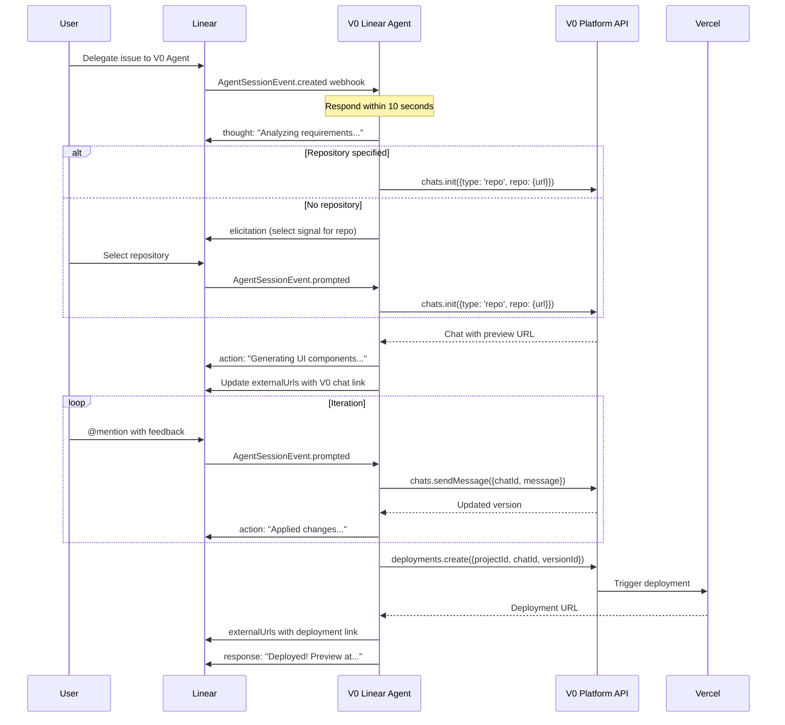

# V0 Linear Agent – Platform API Specification

> This document defines the integration between the V0 Linear Agent and the V0 Platform API.

## V0 Platform API

### SDK Installation
```bash
pnpm add v0-sdk
```

### Authentication
```bash
# .env
V0_API_KEY=your_api_key_here
```
```typescript
import { v0 } from 'v0-sdk'  // Auto-uses V0_API_KEY env var
```

### Core API Methods

| Resource | Method | Purpose |
|----------|--------|---------|
| **Projects** | `v0.projects.create()` | Create project linked to Vercel |
| **Projects** | `v0.projects.find()` | List workspace projects |
| **Chats** | `v0.chats.create()` | Start from scratch with AI generation |
| **Chats** | `v0.chats.init()` | Import from files, GitHub repo, registry, or template |
| **Chats** | `v0.chats.sendMessage()` | Continue conversation (multi-turn) |
| **Deployments** | `v0.deployments.create()` | Deploy to Vercel directly |

### Model Tiers

| Model | Characteristics | Complexity Mapping |
|-------|-----------------|-------------------|
| **v0 Mini** | Lightning-fast, near-frontier intelligence | L1-L2 (simple UI, single component) |
| **v0 Pro** | Balanced speed/intelligence, superior for most tasks | L3 (multi-component, standard features) |
| **v0 Max** | Maximum intelligence for complex work | L4-L5 (architectural, complex layouts) |

### Response Modes

```typescript
// Sync - immediate response
const chat = await v0.chats.create({ message: '...', config: { responseMode: 'sync' } })

// Async - returns placeholder, poll for completion
const chat = await v0.chats.create({ message: '...', config: { responseMode: 'async' } })

// Streaming (experimental)
const chat = await v0.chats.create({ message: '...', config: { responseMode: 'experimental_stream' } })
```

---

## Workflow



---

## Key API Examples

### Create Chat from Linear Issue
```typescript
const chat = await v0.chats.create({
  system: 'You are building React components with Tailwind CSS',
  message: issue.description,
  projectId: project.id,
  config: {
    responseMode: 'async',
    thinking: true,
  }
})
```

### Import Existing Repository
```typescript
const chat = await v0.chats.init({
  type: 'repo',
  repo: {
    url: 'https://github.com/org/repo',
  },
  projectId: project.id,
})
```

### Deploy to Vercel
```typescript
const deployment = await v0.deployments.create({
  projectId: project.id,
  chatId: chat.id,
  versionId: chat.latestVersion.id,
})
// deployment.url contains the live URL
```

### Continue Conversation
```typescript
const response = await v0.chats.sendMessage({
  chatId: chat.id,
  message: 'Add dark mode support',
})
```

---

## Native Integrations

| Feature | V0 Provides | No Need to Build |
|---------|-------------|------------------|
| GitHub repo import | `chats.init({type: 'repo'})` | Custom Octokit integration |
| Preview deployments | `deployments.create()` | Vercel API calls |
| File extraction | `chat.files` array | Custom parsing |
| Version tracking | `chat.latestVersion` | Custom state management |
| Live preview | `chat.demo` URL | Hosting infrastructure |

---

## Related Documentation

- [V0 Platform API Overview](https://v0.app/docs/api/platform)
- [V0 Platform API Quickstart](https://v0.app/docs/api/platform/quickstart)
- [Linear Agent Spec](https://linear.app/developers/agents)
